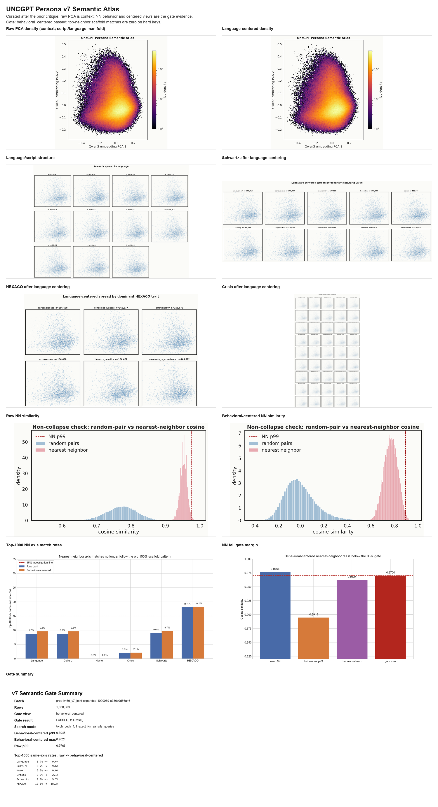
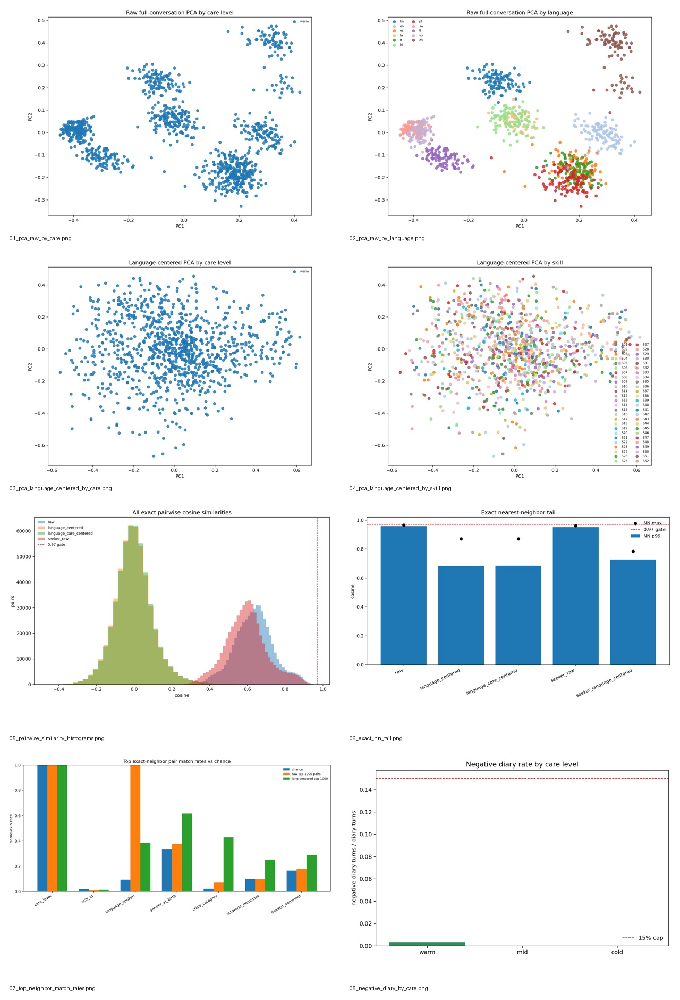

# UncGPT — NeurIPS 2026 Competition Track

Six preregistered tracks on one persona-conditioned caregiving benchmark, evaluated with one shared scorer on a hidden eval cohort.

**Companion to:** [NeurIPS 2026 Competition Track proposal](./competitions_neurips_2026.pdf) · [Hugging Face collection](https://huggingface.co/collections/Reza2kn/uncgpt-2026-neurips-competition-6a081d4a2a5645643dc999b4) · [OpenReview profile](https://openreview.net/profile?id=~Reza_Sayar1)

---

## Tracks

| # | Track | Public bundle | Hidden eval | Ranking driver |
|---|---|---:|---:|---|
| 1 | English | 2,048 | 512 | utility + tool exact − safety penalty |
| 2 | Multilingual (11 languages) | 2,816 | 1,408 | 0.6·language mean + 0.4·language floor |
| 3 | Low-Resource (bn, fa, sw, yo, tl) | 1,920 | 960 | 0.7·language score + 0.3·robustness |
| 4 | Empathic / Disability-Care | 1,024 | 512 (192 manual cap) | supportive utility + scope discipline − safety penalty |
| 5 | Dataset (fixed retrain recipe) | 2,000 | shared hidden | mean lift, then variance, safety floor, provenance |
| 6 | Federated (5 clients, DP) | 2,000 | shared hidden | 0.5·U₁ + 0.3·U₄ + 0.2·U₈ + DP fields valid |

Per-track details: [tracks/](tracks/).

---

## Substrate at a glance

### Personas

**1,000,069** synthetic personas. **15,000** names with zero gaps. Public at [`Reza2kn/uncgpt-personas`](https://huggingface.co/datasets/Reza2kn/uncgpt-personas).



Personas span 11 languages, multiple cultural/gender/value/trait axes, and crisis profiles. Semantic embeddings do **not collapse** to a single cluster — the atlas above is colored per axis to show structured spread.

More charts: [data/personas/](data/personas/).

### Conversations

**4,761** approved multi-turn conversations across **11 languages**, **69 skill axes**, and **3 care levels** (warm / mid / cold, 1,587 each). 8–20 turns per conversation, mean **17.89**, **85,194** total turns. Public at [`Reza2kn/uncgpt-conversations-v7-69-total`](https://huggingface.co/datasets/Reza2kn/uncgpt-conversations-v7-69-total).



Conversations passed three gates: a programmatic gate (no diary leak, no skill leak), a semantic gate (sentence-embedding cohort centering with σ-bounded tolerance), and a register gate (per-language informal-only enforcement, e.g. tú-not-usted, tu-not-shoma).

More charts: [data/conversations/](data/conversations/) and [semantic-analysis/](semantic-analysis/).

### Reference model — UncGPT v1

**70,972,304** total parameters, **43,164,960** active per token. Hybrid: **Hymba** parallel attention + **Mamba2** state-space + **BitNet**-quantized **Mixture-of-Experts** FFN. 12 layers, d_model 448, vocab 8192, ctx 1024. Public smoke checkpoint at [`Reza2kn/uncgpt-69-smoke-checkpoints-20260515`](https://huggingface.co/Reza2kn/uncgpt-69-smoke-checkpoints-20260515).


Full-pass training (12,399 steps, cosine 3e-4 → 3e-5, single A100 80GB, ~2,330 tok/s, 12,395 logged steps before checkpoint save). Final loss **2.26**. Architecture and training details in [models/v1/](models/v1/).

In-browser demo: [`Reza2kn/uncgpt-69-hybrid-demo`](https://huggingface.co/spaces/Reza2kn/uncgpt-69-hybrid-demo) (WebGPU).

---

## Layout

```
.
├── competitions_neurips_2026.pdf  ← the proposal
├── README.md                      ← this file
├── tracks/                        ← per-track design + scoring
├── data/personas/                 ← persona pool stats + charts
├── data/conversations/            ← conversation pool stats + charts
├── semantic-analysis/             ← non-collapse evidence
├── models/v1/                     ← reference model card
├── figures/                       ← all charts in one place
│   ├── persona/                   ← 8 persona analysis charts
│   ├── conversation/              ← 7 conversation analysis charts
│   └── training/                  ← v1 training curves
└── notebooks/                     ← Colab starters (post-acceptance)
```

---

## Status

| Component | State |
|---|---|
| Persona pool (1M+) | public |
| Names registry (15k, zero gaps) | public |
| Live-approved conversation pool (4,761) | public |
| Reference v1 smoke checkpoint | public |
| WebGPU in-browser demo | public |
| Semantic non-collapse analysis | public (in this repo) |
| v1 full-pass weights | training complete (final loss 2.26); HF mirror at acceptance |
| Per-track public bundles | committed locally; HF mirror at launch |
| Public scorer | committed locally; HF dataset card update at launch |
| Starter Colab notebooks | local; published with starter kit at acceptance |
| CodaBench instance | post-acceptance |

---

## License

- Datasets: see individual Hugging Face dataset cards.
- Code: Apache-2.0.
- Documentation and figures: CC-BY-4.0.
