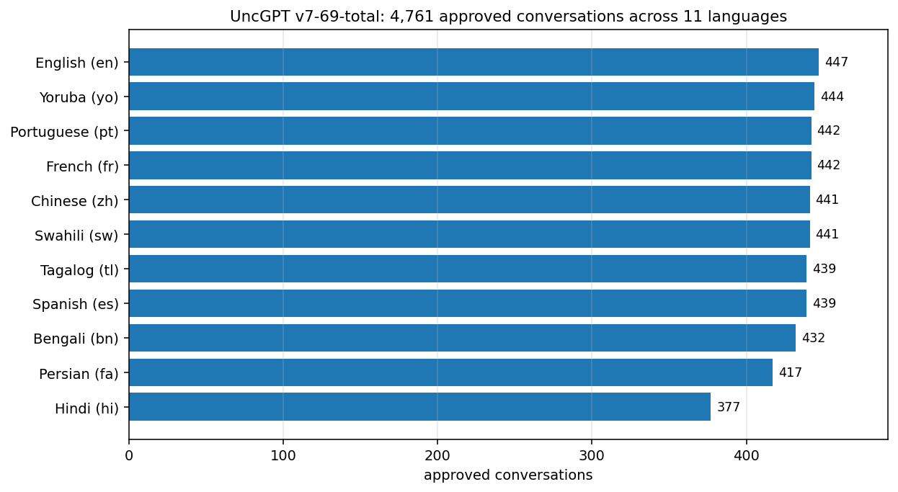
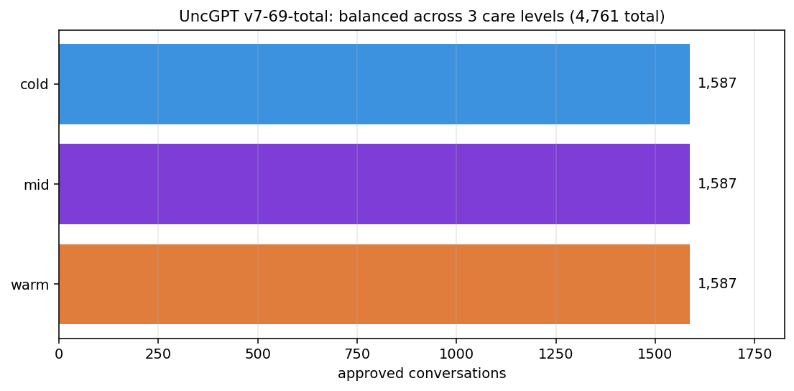
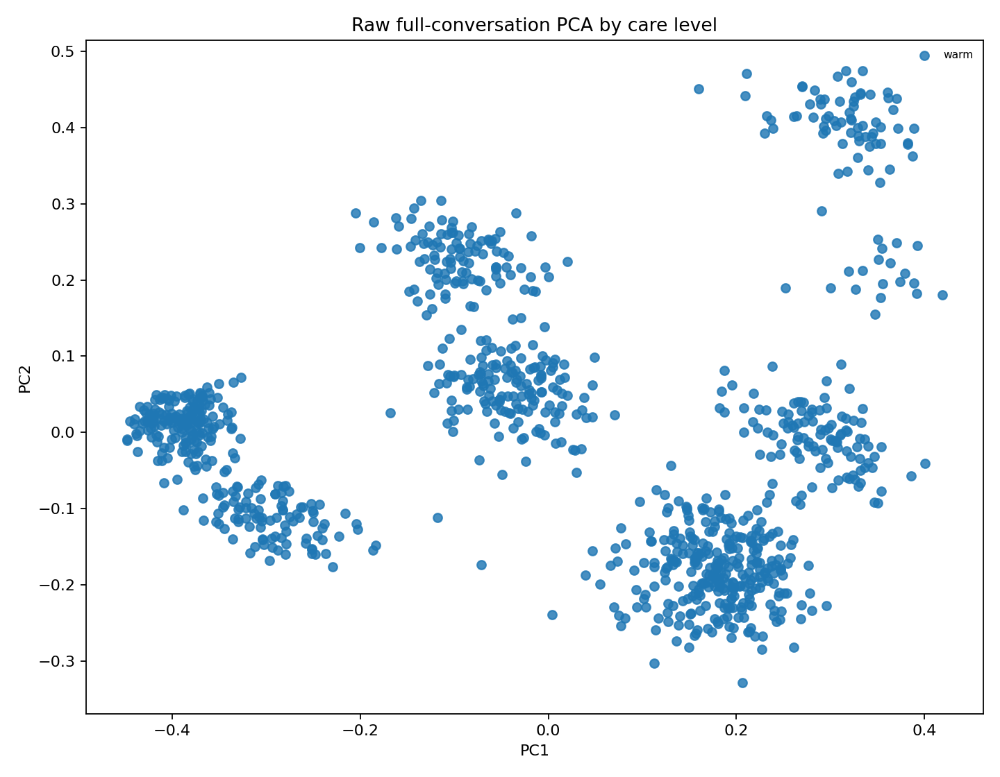
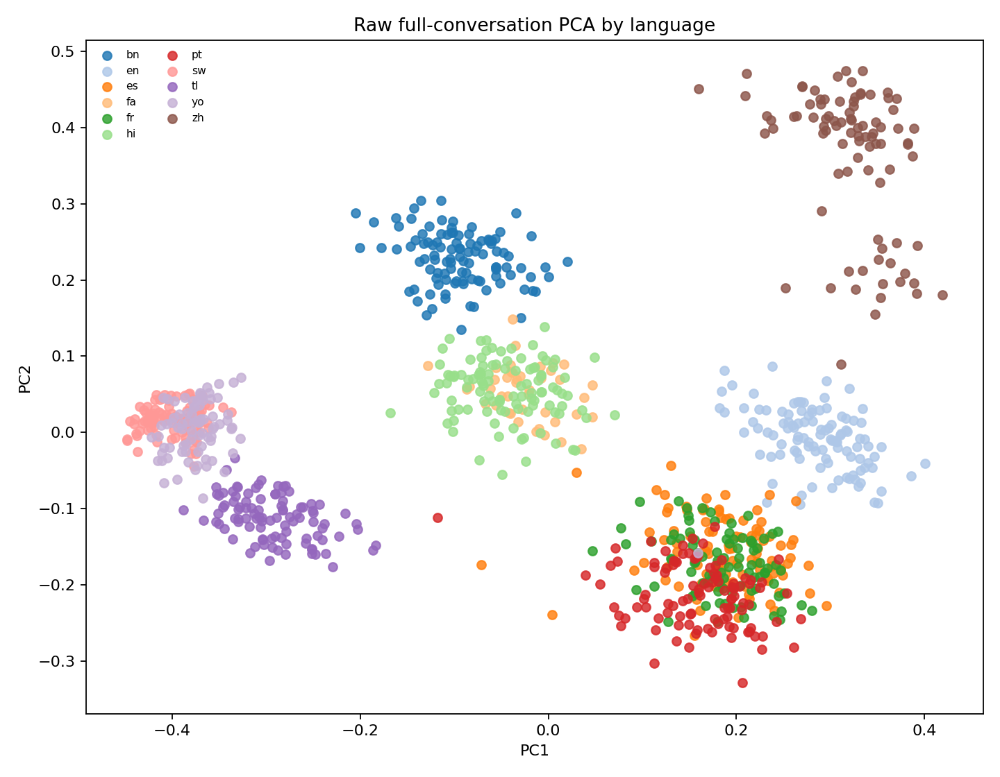
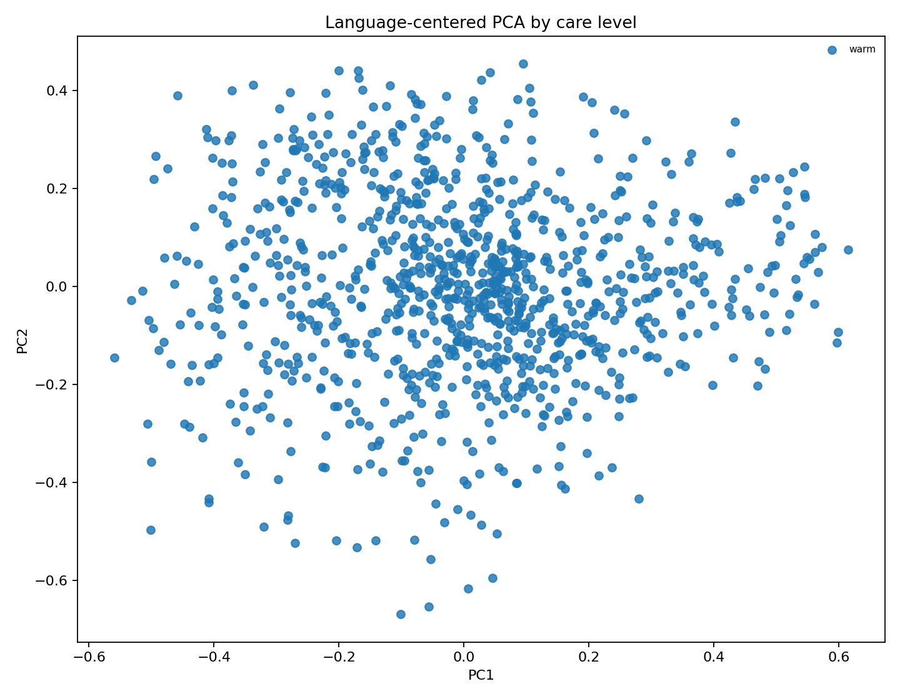
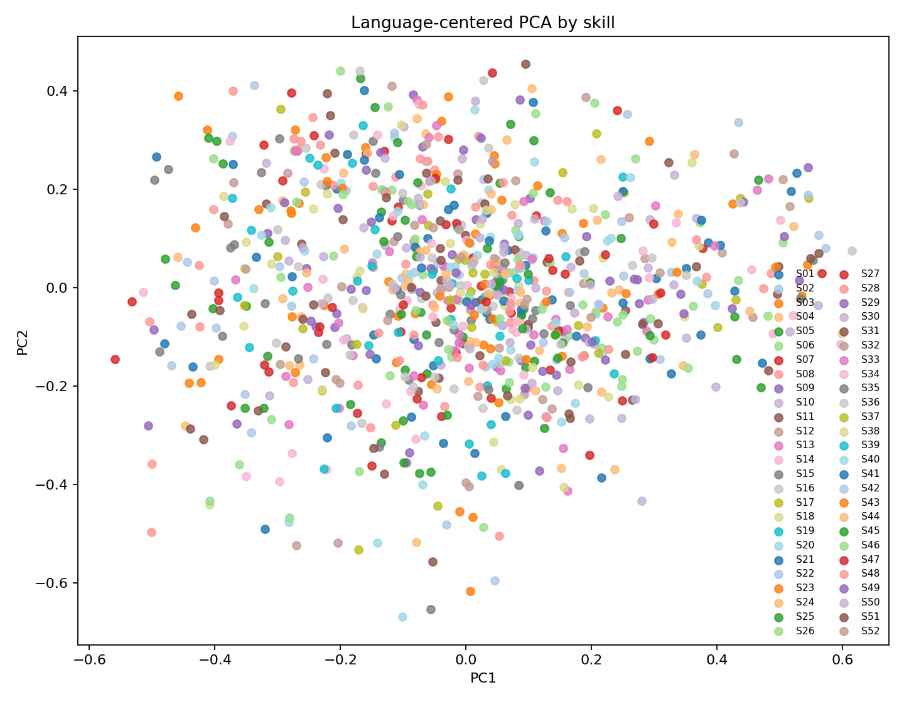

# Conversation pool

**4,761 approved multi-turn conversations.** Hosted at [`Reza2kn/uncgpt-conversations-v7-69-total`](https://huggingface.co/datasets/Reza2kn/uncgpt-conversations-v7-69-total).

## Balance

| Axis | Distribution |
|---|---|
| Languages | 11 (en, yo, fr, pt, sw, zh, es, tl, bn, fa, hi) |
| Skill axes | 69 (all covered) |
| Care levels | 3 (1,587 warm / 1,587 mid / 1,587 cold) |
| Turns / conversation | 8–20 (mean 17.89) |
| Total turns | 85,194 |
| Finish reasons | clean stop on both sides for 100% of turns |

### Per-language counts

### Per-care balance

## Gate stack

Conversations passed three gates before approval:

1. **Programmatic gate.** No diary-field leak into the visible transcript. No skill-axis text in the seeker prompt. Completion integrity (no ellipsis-tails, no dangling words). Language-purity floor per turn.
2. **Semantic gate.** Sentence embeddings centered per language, then bounded by a σ-tolerance against a gold-pool semantic boundary. Three named cohorts (1.25σ tight, 1.25σ repaired, 1.50σ candidate) are public for ablation.
3. **Register gate.** Per-language informal-only enforcement. tú-not-usted Spanish, tu-not-shoma Persian, 你-not-您 Chinese, no po/opo in Tagalog, plain not keigo in Japanese. The "uncle" character maintains tonal distance through brevity, not honorifics.

Audit summary (4,761 cohort):

- 19 message-level integrity flags out of 85,194 (0.022%)
- 1,310 formal-register messages out of 93,854 scored (1.4%); 323 conversations with more than 1 formal turn
- 19 visible diary-field leak turns across 13,097 grandpa/uncle_v2 turns (0.15%)

The text-clean subset used for embedding analysis is 4,423 of 4,761 (93%).

## Semantic non-collapse

The atlas and PCA charts below test whether the conversations form one homogeneous blob or whether the axes the gates were designed to preserve (language, care, skill) actually separate.

### Conversation semantic atlas

### PCA by care level (raw)

### PCA by language (raw)

### PCA language-centered, by care level

### PCA language-centered, by skill axis

## Related cohorts

| Dataset | Use |
|---|---|
| [`uncgpt-conversations-v7-69-total`](https://huggingface.co/datasets/Reza2kn/uncgpt-conversations-v7-69-total) | live-approved 4,761 (current canonical) |
| [`uncgpt-conversations-semantic-approved-1p25`](https://huggingface.co/datasets/Reza2kn/uncgpt-conversations-semantic-approved-1p25) | tight semantic-gate cohort (1.25σ) |
| [`uncgpt-conversations-semantic-approved-1p25-repaired-paperclip`](https://huggingface.co/datasets/Reza2kn/uncgpt-conversations-semantic-approved-1p25-repaired-paperclip) | leak-repaired, normalized diary fields |
| [`uncgpt-conversations-semantic-approved-1p50-candidate`](https://huggingface.co/datasets/Reza2kn/uncgpt-conversations-semantic-approved-1p50-candidate) | wider-tolerance candidate cohort (1.50σ) |
| [`uncgpt-conversations-informal-approved-1p25`](https://huggingface.co/datasets/Reza2kn/uncgpt-conversations-informal-approved-1p25) | register-filtered subset |
| [`uncgpt-persian-ultraclean-review-2026-05-14`](https://huggingface.co/datasets/Reza2kn/uncgpt-persian-ultraclean-review-2026-05-14) | Persian-only manual review pool |

## Provenance

Conversations are **synthetically generated** by a multi-agent harness (seeker, uncle, optional grand-uncle reflector). No human data was scraped. Generation pipeline lives in [`Reza2kn/KakoVerse`](https://github.com/Reza2kn/KakoVerse).
