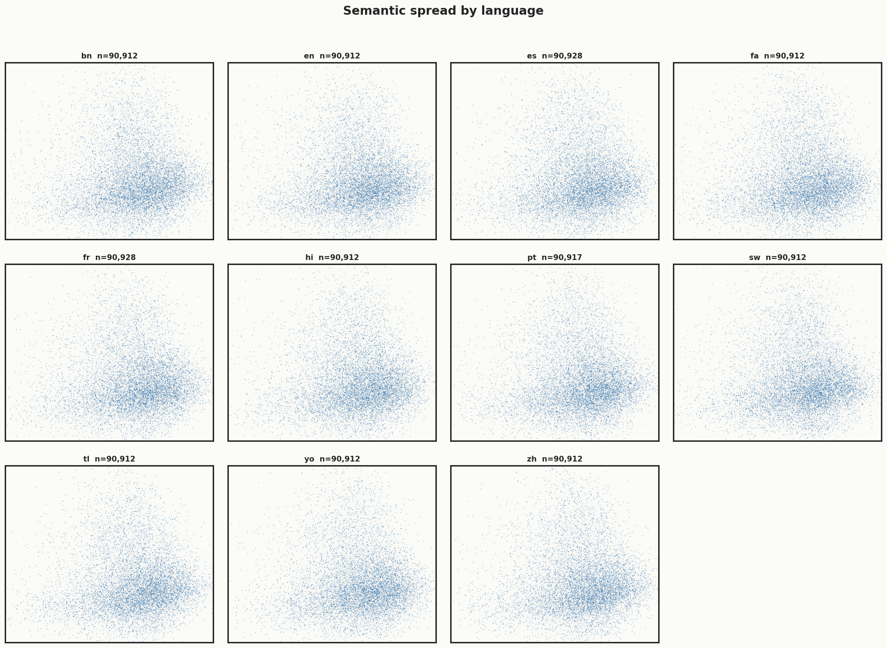
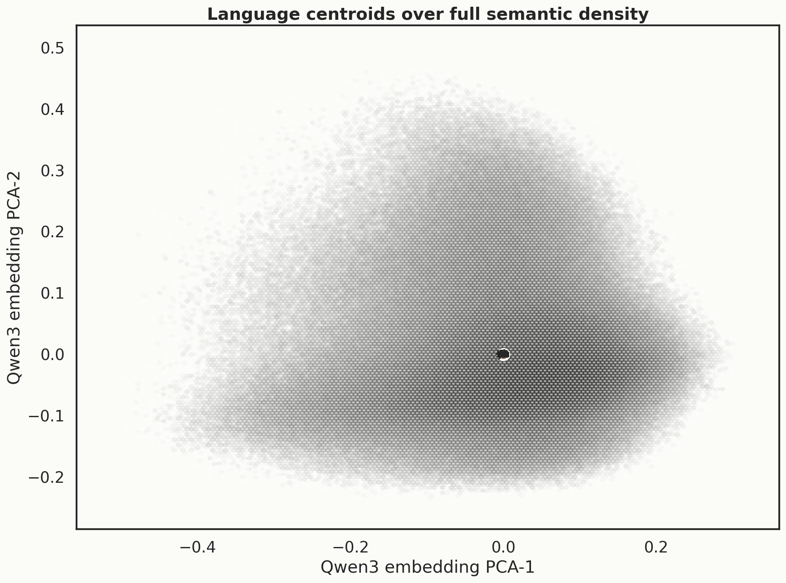
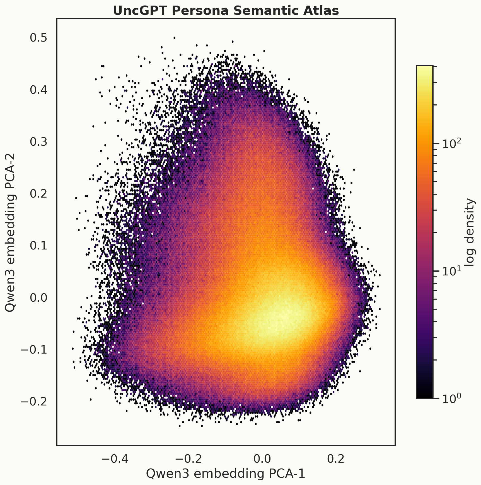
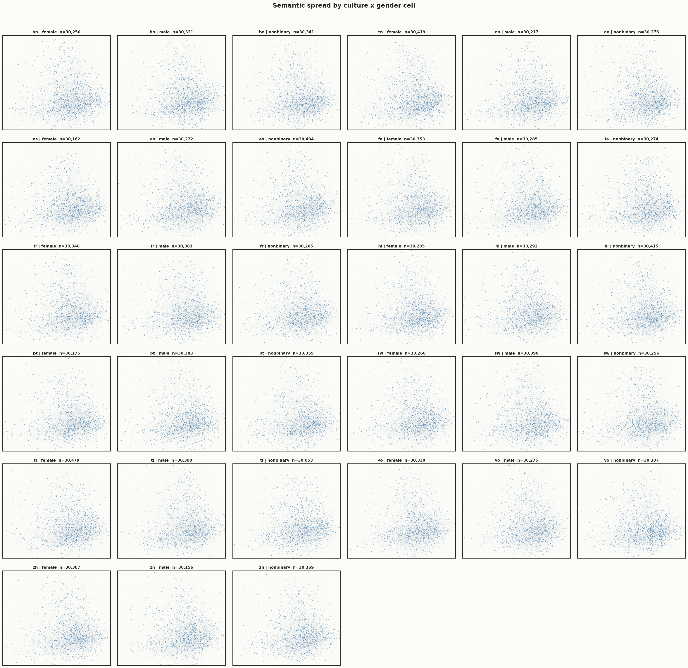
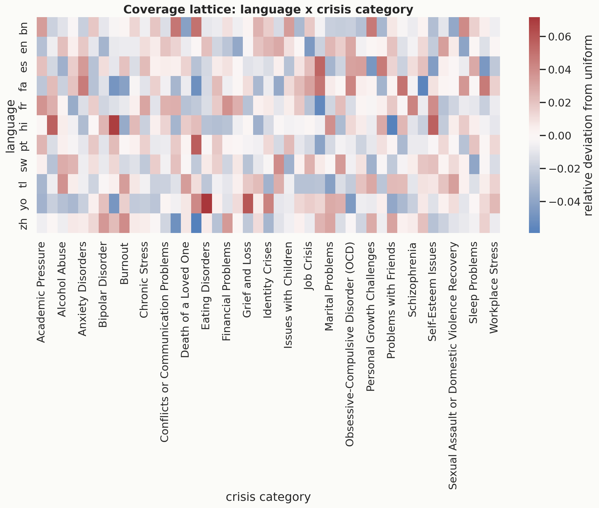
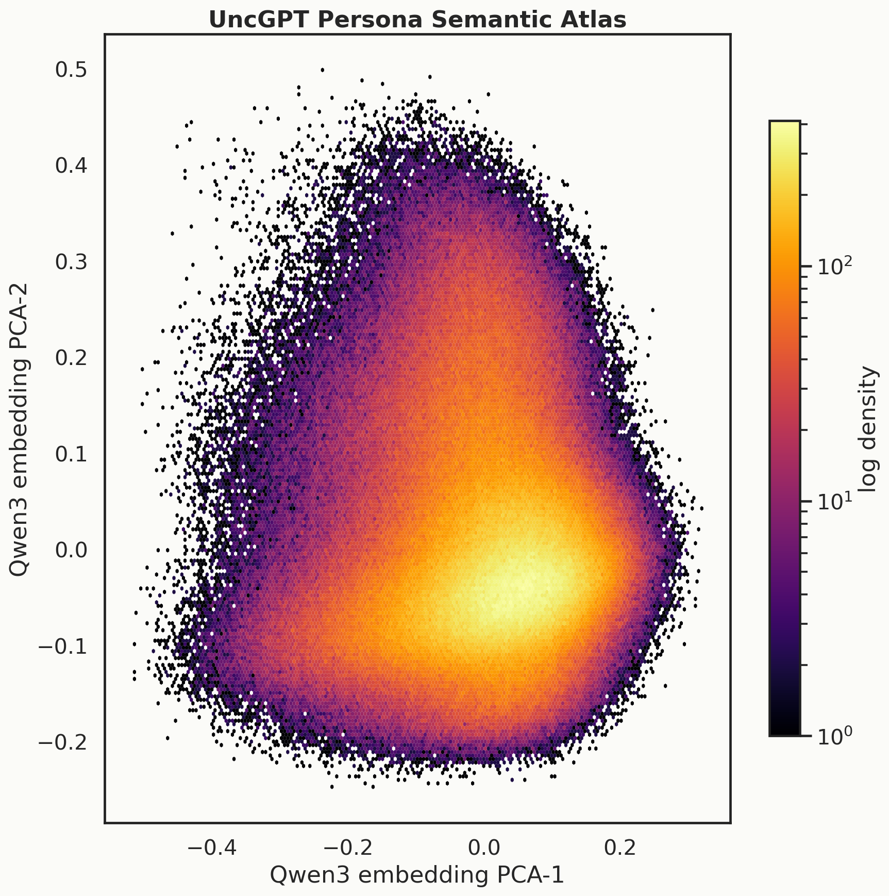
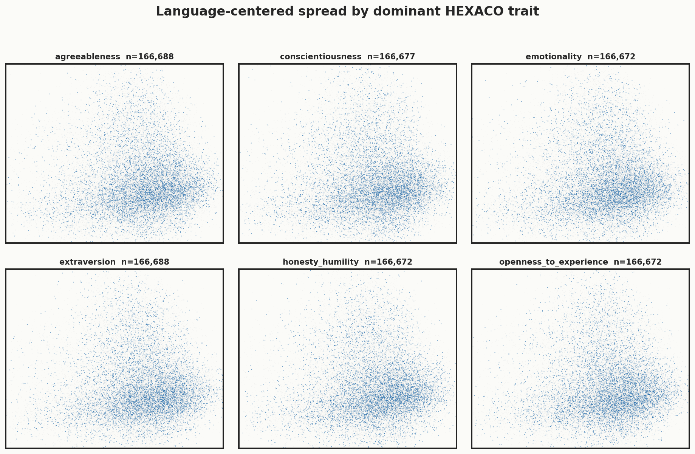

# Persona pool

**1,000,069 synthetic personas** with **15,000 names** (zero gaps in the names build report). Hosted at [`Reza2kn/uncgpt-personas`](https://huggingface.co/datasets/Reza2kn/uncgpt-personas).

## Fields

Each persona has 23 columns including:

- identifier + balance fields (gender, language, culture, age band)
- geographic fields (region, country)
- the full serialized persona JSON payload

The payload includes Schwartz values, HEXACO traits, family / social configuration, employment, household, coping style, and stage-2 generated per-persona sub-pools (crisis profiles, symptom sets, trigger sets, value expressions, natural tendency sets).

## Semantic spread

Sentence-embedding analysis of persona descriptions. Each chart is a 2-D projection (UMAP or PCA) of the same embedding space, colored by a different axis. The point is to show the pool is **not collapsed** to one homogeneous blob.

### Curated atlas

### By language (11 languages)

### Per-language centroids

### Density (overall)

### By culture × gender cell

### Language × crisis-profile lattice

### Language-centered density
The persona embeddings have an obvious language axis that dominates raw projections. After subtracting the per-language centroid, the residual structure shows non-language axes (values, traits, crisis, etc.) are still meaningfully separated.

### Language-centered, colored by HEXACO trait

## Provenance

All personas are **synthetically generated**. No human data was scraped. Generation pipeline lives in [`Reza2kn/KakoVerse`](https://github.com/Reza2kn/KakoVerse). Seed lexicons are publicly licensed (OLDI Wikipedia MT seeds, Common Voice 24 fa for orthographic priors).
