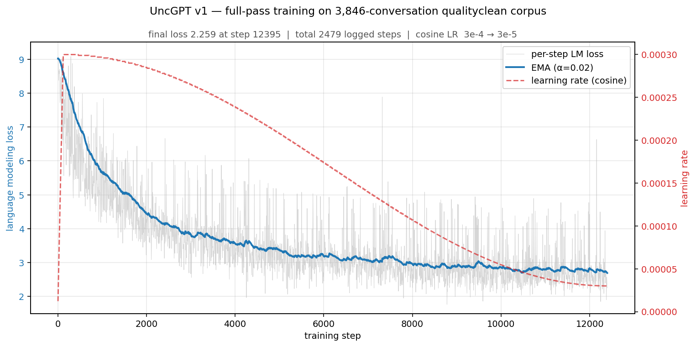
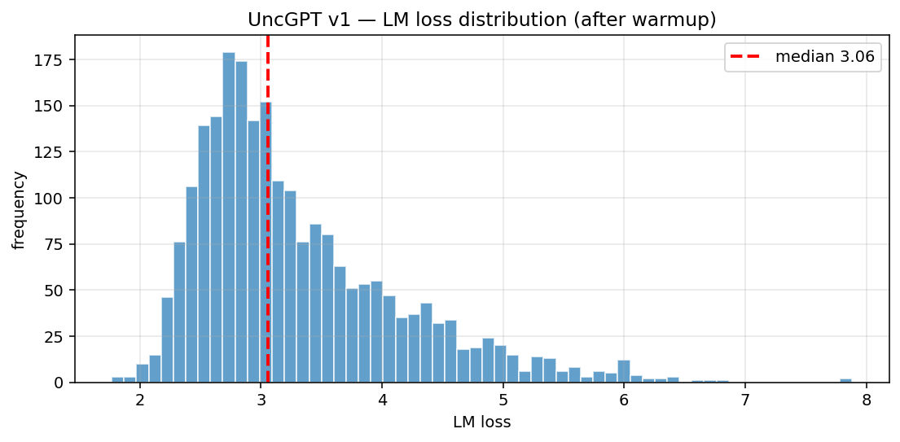

# UncGPT v1 — reference small model

Hybrid sub-100M-parameter caregiving model. Designed to be reproducible on a single A100 in hours, and runnable in the browser via WebGPU.

- **Total parameters:** 70,972,304
- **Active per token:** 43,164,960
- **Architecture class:** `UncGPTv1` (`model/uncgpt_v1.py` in the training repo)
- **Browser demo:** [`Reza2kn/uncgpt-69-hybrid-demo`](https://huggingface.co/spaces/Reza2kn/uncgpt-69-hybrid-demo) (WebGPU)
- **Step-100 smoke checkpoint:** [`Reza2kn/uncgpt-69-smoke-checkpoints-20260515`](https://huggingface.co/Reza2kn/uncgpt-69-smoke-checkpoints-20260515)

## Architecture

12-layer block stack combining three building blocks:

| Block | Role | Key params |
|---|---|---|
| Hymba-style parallel attention | local + global token mixing | 4 Q heads, head_dim 32, KV groups 1 / 2 |
| Mamba2 state-space | long-range dependency, on layers {1, 2, 4, 5, 6, 7} | state 64, conv_dim 4, expand 1, 8 heads |
| BitNet-quantized Mixture-of-Experts FFN | sparse capacity | 1 shared (ffn_dim 1169) + 6 routed (ffn_dim 369), top-k 2, z-loss 1e-3, capacity 2.0 |

Shared shape: d_model 448, vocab 8192, train context 1024, RoPE θ = 1e4, tied embeddings.

## Tokenizer

8,192-piece multilingual byte-fallback SentencePiece, trained on the qualityclean cohort. Covers all 11 languages in the conversation pool.

## Training

| Setting | Value |
|---|---|
| Corpus | 3,846-row `longctx_stage1_1k_live_qualityclean_langtag` (filtered subset of the 4,761-conversation gold pool) |
| Tokens / batch | 1,024 |
| Total steps | 12,399 |
| Schedule | cosine, peak 3e-4 → min 3e-5, 123 warmup steps |
| Precision | bf16 |
| Weight decay | 0.1 |
| Gradient clip | 1.0 |
| Curriculum | ordered-skill blocks with sample-weight cap 2.0 |
| Hardware | single NVIDIA A100-SXM4-80GB |
| Throughput | ~2,330 tok/s sustained |
| Checkpoints | every 1,000 steps |

## Training curve

Final logged loss **2.26** at step 12,395 (out of 12,399). z_loss settled at ~0.002 indicating healthy expert balance.

## Reproducing

The training script, model source, tokenizer, and YAML config are released with the full-pass weights on Hugging Face at acceptance. The smoke checkpoint repo already contains the model source and configs.
